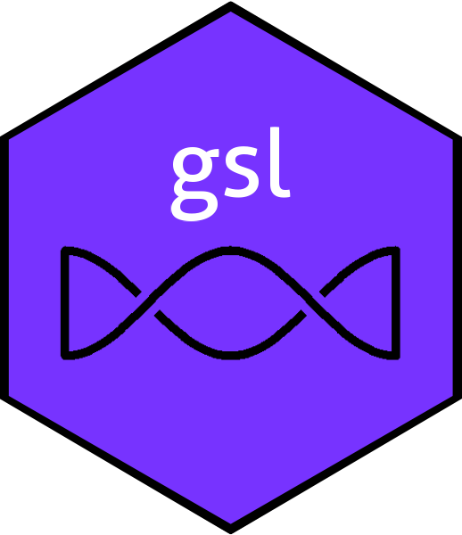

The gsl R package: a wrapper for the GSL C library
================

<!-- badges: start -->

<!-- badges: end -->

The gsl R package is a wrapper for the GSL C library (note
capitalization).  You can get further information on GSL at

https://www.gnu.org/software/gsl/

# Installation from CRAN

You can install the released version of the gsl R package from
[CRAN](https://CRAN.R-project.org) by typing

`install.packages("gsl")`

`library("gsl")`

at the R command prompt.

# Installation from source

Installing the gsl R package from source requires you to install the
GSL C library first.  *Over 99.9% of reports to me about gsl are due
to people not understanding what this means*.

Before reporting any "bugs", ensure that you can compile and run a
simple test program such as the example program near the start of the
GSL Reference Manual.  It is not the purpose of this document to show
people how to install GSL: for this, visit
https://www.gnu.org/software/gsl/

# Further information

For more detail on package structure and design philosophy, see the
package vignette

`vignette("gslpaper")`
